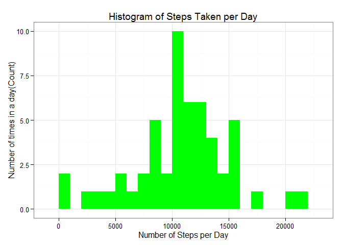
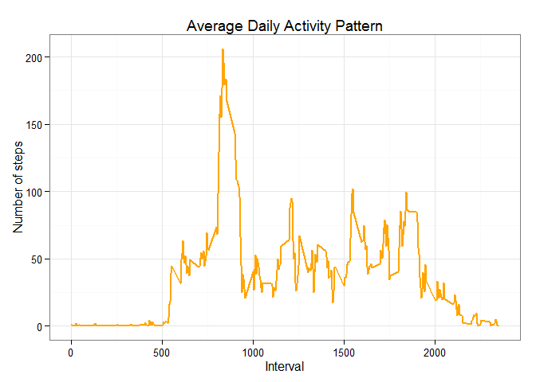

# Reproducible Research: Peer Assessment 1


## Loading and preprocessing the data

Loading the 'activity.csv' data using read.csv().

Note: It is assumed that the file 'activity.csv' is in the current working directory. 


```r
data <- read.csv('activity.csv', header = TRUE, sep = ",",
                  colClasses=c("numeric", "character", "numeric"))
```


```r
data$date <- as.Date(data$date, format = "%Y-%m-%d")
data$interval <- as.factor(data$interval)
```


```r
str(data)
```

```
## 'data.frame':	17568 obs. of  3 variables:
##  $ steps   : num  NA NA NA NA NA NA NA NA NA NA ...
##  $ date    : Date, format: "2012-10-01" "2012-10-01" ...
##  $ interval: Factor w/ 288 levels "0","5","10","15",..: 1 2 3 4 5 6 7 8 9 10 ...
```

```r
## What is mean total number of steps taken per day?
```


## What is the average daily activity pattern?

First is to calculate the total steps per day by neglecting the missing values. This is due to the fact that the missing values exist did not harm the analysis in a big way.


```r
steps_daily <- aggregate(steps ~ date, data, sum)
colnames(steps_daily) <- c("date","steps")
head(steps_daily)
```

```
##         date steps
## 1 2012-10-02   126
## 2 2012-10-03 11352
## 3 2012-10-04 12116
## 4 2012-10-05 13294
## 5 2012-10-06 15420
## 6 2012-10-07 11015
```

Creating a histogram for the total number of steps taken per day, and ggplot is used to plot the histogram in an appropriate bin interval.


```r
library(ggplot2)
```

```
## Warning: package 'ggplot2' was built under R version 3.2.2
```

```r
ggplot(steps_daily, aes(x = steps)) + 
       geom_histogram(fill = "green", binwidth = 1000) + 
        labs(title="Histogram of Steps Taken per Day", 
             x = "Number of Steps per Day", y = "Number of times in a day(Count)") + theme_bw() 
```

 

Now we calculate the mean and median of the number of steps taken per day.


```r
mean_steps   <- mean(steps_daily$steps, na.rm=TRUE)
median_steps <- median(steps_daily$steps, na.rm=TRUE)
```
The mean = 10766.189
The median = 10765
Mean median are mismatched

Calculating the aggregate of steps using 5 minute intervals.
Converting the intervals onto integer
Save the data into steps_inter.


```r
steps_inter <- aggregate(data$steps, by = list(interval = data$interval),
                                FUN=mean, na.rm=TRUE)
#convert to integers
steps_inter$interval <- as.integer(levels(steps_inter$interval)[steps_inter$interval])
colnames(steps_inter) <- c("interval", "steps")
```

1. We make the plot with the time series of the average number of steps taken (averaged across all days) versus the 5-minute intervals:


```r
ggplot(steps_inter, aes(x=interval, y=steps)) +   
        geom_line(color="orange", size=1) +  
        labs(title="Average Daily Activity Pattern", x="Interval", y="Number of steps") +  
        theme_bw()
```

 

Finding the 5-minute interval with the maximum no. of steps:


```r
max_interval <- steps_inter[which.max(steps_inter$steps),]
```
The 835th interval has maximum 206 steps.


## Imputing missing values

#### 1. Total number of missing values:

The total number of missing values in steps can be calculated using the is.na() function to check the missing values
The sum the logical vector.

```r
missing_vals <- sum(is.na(data$steps))
```

The total number of missing values = 2304.

#### 2. Strategy for filling in all of the missing values in the dataset

Missing value will be filled with mean values.
Try to match the mean and median values.

We create a function called na_filler(data, pervalue) to fill in the non available values.


```r
na_filler <- function(data, pervalue) {
        na_index <- which(is.na(data$steps))
        na_replace <- unlist(lapply(na_index, FUN=function(idx){
                interval = data[idx,]$interval
                pervalue[pervalue$interval == interval,]$steps
        }))
        fill_steps <- data$steps
        fill_steps[na_index] <- na_replace
        fill_steps
}

data_fill <- data.frame(  
        steps = na_filler(data, steps_inter),  
        date = data$date,  
        interval = data$interval)
str(data_fill)
```

```
## 'data.frame':	17568 obs. of  3 variables:
##  $ steps   : num  1.717 0.3396 0.1321 0.1509 0.0755 ...
##  $ date    : Date, format: "2012-10-01" "2012-10-01" ...
##  $ interval: Factor w/ 288 levels "0","5","10","15",..: 1 2 3 4 5 6 7 8 9 10 ...
```
Is missing values still there?


```r
sum(is.na(data_fill$steps))
```

```
## [1] 0
```
No missing values anymore.

#### 3. A histogram of the total number of steps taken each day

Now let us plot a histogram of the daily total number of steps taken, plotted with a bin interval of 1000 steps, after filling missing values.

```r
fill_steps_daily <- aggregate(steps ~ date, data_fill, sum)
colnames(fill_steps_daily) <- c("date","steps")

##plotting the histogram
ggplot(fill_steps_daily, aes(x = steps)) + 
       geom_histogram(fill = "blue", binwidth = 1000) + 
        labs(title="Histogram of Steps Taken per Day", 
             x = "Number of Steps per Day", y = "Number of times in a day(Count)") + theme_bw() 
```

 
#### Calculate and report the mean and median total number of steps taken per day.

```r
mean_steps_fill   <- mean(fill_steps_daily$steps, na.rm=TRUE)
median_steps_fill <- median(fill_steps_daily$steps, na.rm=TRUE)
```

The mean = 10766.189 
The median = 10766.189.

#### Do these values differ from the estimates from the first part of the assignment?

Yes, those values are slightly different.

Before filling the data

Mean = 10766.189
Median= 10765

After filling the data

Mean = 10766.189
Median= 10766.189

#### What is the impact of imputing missing data on the estimates of the total daily number of steps?

Mean value remains unchanged, but the median changed subtly and reach similarities after doing the imputing.

The impact of imputing missing values has increase our peak (as shown in the histogram), but there's no negative impact towards the earlier prediction.

## Are there differences in activity patterns between weekdays and weekends?

Yes, and these are the steps taken adjust the patterns to be matched:

1. Adjusting the table with a column that indicates the day of the week
2. Subset the table into two parts - weekends (Saturday and Sunday) and weekdays (Monday through Friday).
3. Tabulate the average steps per interval for each data set.
4. Plot the two data sets side by side for comparison.


```r
weekdays_steps <- function(data) {
    weekdays_steps <- aggregate(data$steps, by=list(interval = data$interval),
                          FUN=mean, na.rm=T)
    # convert to integers for plotting
    weekdays_steps$interval <- 
            as.integer(levels(weekdays_steps$interval)[weekdays_steps$interval])
    colnames(weekdays_steps) <- c("interval", "steps")
    weekdays_steps
}

data_by_weekdays <- function(data) {
    data$weekday <- 
            as.factor(weekdays(data$date)) # weekdays
    weekend_data <- subset(data, weekday %in% c("Saturday","Sunday"))
    weekday_data <- subset(data, !weekday %in% c("Saturday","Sunday"))

    weekend_steps <- weekdays_steps(weekend_data)
    weekday_steps <- weekdays_steps(weekday_data)

    weekend_steps$dayofweek <- rep("weekend", nrow(weekend_steps))
    weekday_steps$dayofweek <- rep("weekday", nrow(weekday_steps))

    data_by_weekdays <- rbind(weekend_steps, weekday_steps)
    data_by_weekdays$dayofweek <- as.factor(data_by_weekdays$dayofweek)
    data_by_weekdays
}

data_weekdays <- data_by_weekdays(data_fill)
```
The average number of steps taken per 5-minute interval across weekdays and weekends comparison are shown in the panel plot:

```r
ggplot(data_weekdays, aes(x=interval, y=steps)) + 
        geom_line(color="violet") + 
        facet_wrap(~ dayofweek, nrow=2, ncol=1) +
        labs(x="Interval", y="Number of steps") +
        theme_bw()
```

 

Activities ont the Weekday showed the highest peak from all steps intervals. The same trend of high peaks also shown during the weekends.We assume that employees also spare some free time to do some activities.Weekend showed significant amount of activities distributed along that time.
